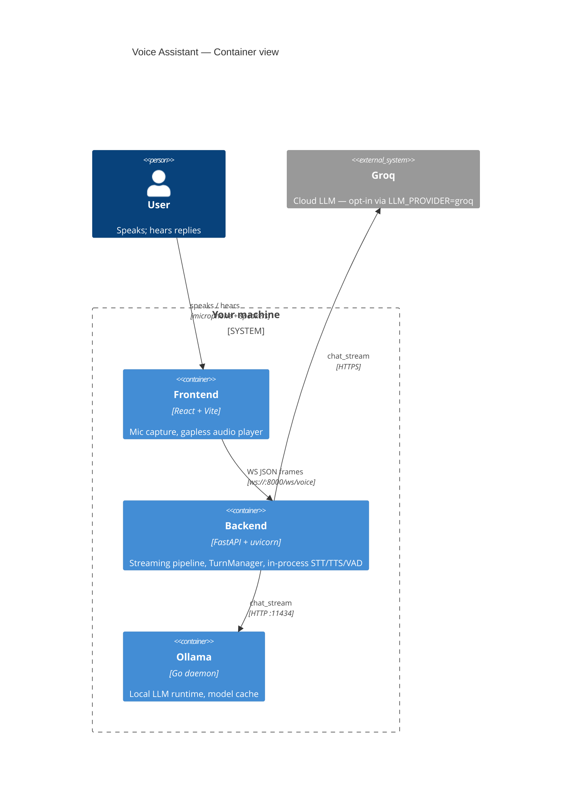
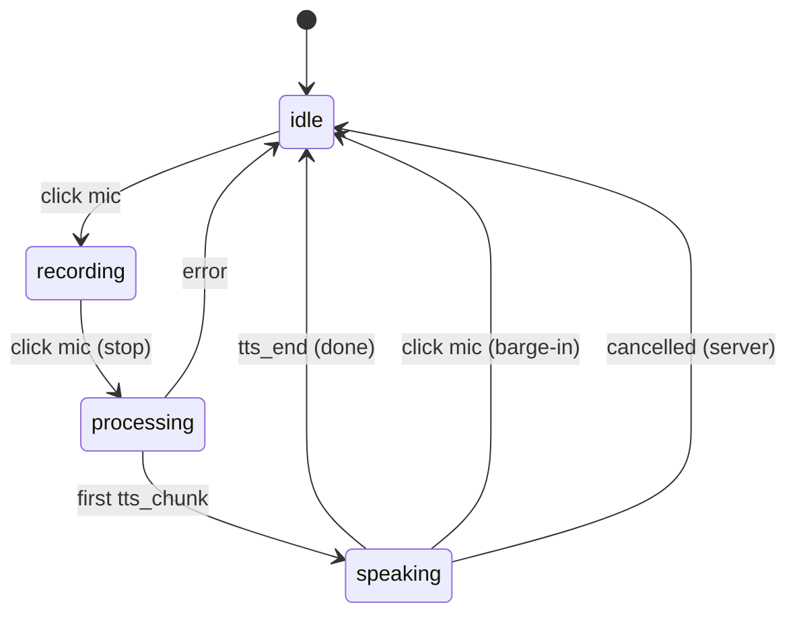
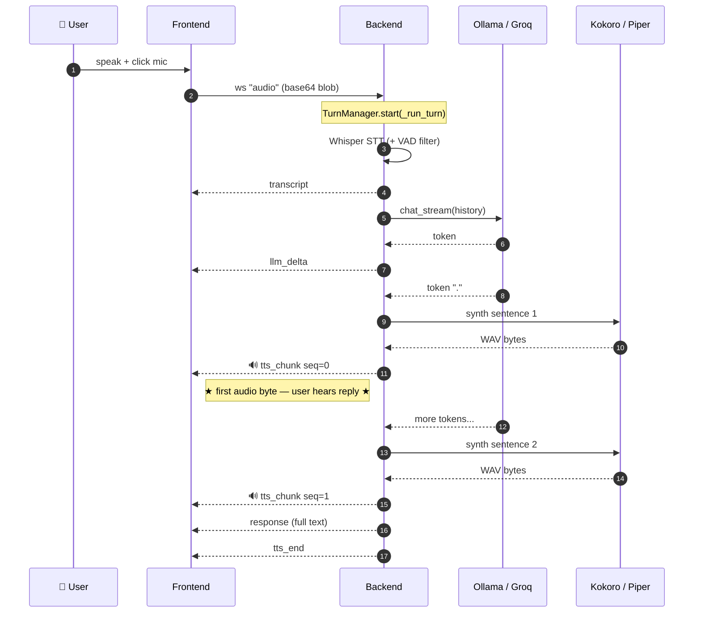

# Architecture

This document is the "why" to the README's "what." It walks the dataflow, every component choice we made, and the tradeoff we accepted.

## Contents

- [System overview](#system-overview)
- [Dataflow: one voice turn, end to end](#dataflow-one-voice-turn-end-to-end)
- [Component choices and tradeoffs](#component-choices-and-tradeoffs)
- [Failure modes](#failure-modes)
- [Performance model](#performance-model)
- [Extending the system](#extending-the-system)
- [Credits](#credits)

---

## System overview

Three processes, one WebSocket.



We chose in-process for STT/TTS/VAD because the interactive budget is tight and every IPC hop costs milliseconds we cannot afford. Ollama is a separate process because it's a separate lifecycle (model pulls, GPU access, warm-up) and already has a stable HTTP interface.

### UI state machine

The frontend's `status` drives every visual cue. Barge-in and server cancellation share the same exit.



---

## Dataflow: one voice turn, end to end

### The picture (streaming mode)

This is the whole game: TTS starts emitting audio *while* the LLM is still generating. The star marks the moment the user first hears the assistant.



### The walkthrough

### Click-to-talk mode (`stream=1`)

```
1. User clicks mic.
   Frontend: new MediaRecorder, mic stream to WebM/Opus buffer.

2. User clicks mic again.
   Frontend: stopRecording() → audio Blob → base64 → WS send
            {"type": "audio", "data": "..."}
   Timer T0 starts.

3. Server TurnManager.start(_run_turn(...))
   ├─ stt_service.transcribe(bytes)
   │    ├─ Faster-Whisper decode (ffmpeg under the hood)
   │    ├─ Silero VAD filters silence segments
   │    └─ returns {text, duration, speech_duration, vad_trimmed_ms}
   ├─ WS emit {"type":"transcript","text":...}                         (T ≈ STT)
   ├─ llm_service.chat_stream(transcript, history)
   │    └─ async_iter_sync bridges Ollama's sync generator
   │       ├─ token 0   → WS emit {"type":"llm_delta","delta":...}    (T ≈ STT + LLM-TTFT)
   │       ├─ token N   → splitter.push(token)
   │       │              └─ sentence boundary? → yield sentence
   │       │                 └─ tts_service.synthesize(sentence)
   │       │                    └─ WS emit {"type":"tts_chunk","seq":0,"audio":b64,...}
   │       │                       ★ FIRST AUDIO BYTE ★                (T ≈ first_audio_byte_ms)
   │       └─ ... LLM and TTS overlap in time ...
   ├─ splitter.flush() → tail sentence → WS emit final tts_chunk
   ├─ WS emit {"type":"response","text": <full>}
   └─ WS emit {"type":"tts_end","count":N}

4. Frontend:
   - StreamingAudioPlayer enqueues each tts_chunk via decodeAudioData,
     schedules at max(nextStart, currentTime) → gapless playback.
   - Live assistant bubble fills from llm_delta events.

5. Barge-in path (B.5):
   - User clicks mic while speaking.
   - Frontend: player.stop() + ws.send(barge_in)
   - Server: TurnManager.cancel() → Task.cancel() unwinds _run_turn
   - Server: WS emit {"type":"cancelled","reason":"barge_in"}
```

### Continuous mode (`stream=1&continuous=1`, B.4)

Same pipeline, but step 2 is replaced by:

```
2'. Frontend AudioWorklet continuously posts 20 ms PCM16 frames.
    Each frame: {"type": "audio_frame", "pcm16_b64": "..."}
    Server FrameVad ingests each frame:
      - `speech_start` → emit {"type":"vad","speaking":true};
                         if turn in flight → cancel (barge-in)
      - `speech_end`   → drain PCM → wrap as WAV → _run_turn(...)
```

---

## Component choices and tradeoffs

### STT — Faster-Whisper

| Consideration | Decision | Tradeoff |
|---|---|---|
| Quality vs. latency | `base` int8 on CPU | Acceptable on clean English; switch to `large-v3` for Indic or noisy audio |
| Streaming vs. batch | One-shot at end of utterance | Lowest code complexity. True streaming (whisper-streaming, Moonshine) would cut 200–500 ms but adds fragile state. Deferred. |
| Silence handling | `vad_filter=True` (Silero inside Whisper) | Kills silence hallucinations; ~30–80 ms VAD overhead on short inputs |
| Alternatives rejected | whisper.cpp, vanilla `openai-whisper` | Faster-Whisper's CTranslate2 backend is ~4× faster than HF transformers on CPU |

### LLM — Ollama (default), Groq (opt-in)

| Consideration | Decision | Tradeoff |
|---|---|---|
| Local vs. cloud | Ollama default | Privacy, zero cost, offline capable. Quality < frontier APIs. |
| Model choice | `qwen2.5:3b` (Apache-2.0) | Small + fast + genuinely permissive. Llama 3.x has usage clauses. |
| Abstraction | `LLMProvider` Protocol + factory | Adding vLLM/llama.cpp is ~80 LOC. No LangChain/LiteLLM dependency. |
| Streaming | `chat_stream()` + `async_iter_sync` bridge | Unblocks the event loop without forking the SDKs into async |
| Alternatives rejected | In-process llama-cpp-python | Blocks FastAPI workers on model load; Ollama's process boundary is the right call for Phase A/B |

### TTS — Kokoro (default), Piper, OpenVoice

| Consideration | Decision | Tradeoff |
|---|---|---|
| Quality on English | Kokoro (82 M params, Apache-2.0) | Best-in-class quality for its size; only a few languages |
| Multilingual coverage | Piper (MIT) for Hindi/Tamil/Telugu/Bengali/Marathi/… | Voice quality varies; community voices need per-voice license review |
| Voice cloning | OpenVoice v2 (MIT) | XTTS-v2 rejected — CPML is non-commercial |
| Streaming granularity | Sentence-level | Kokoro lacks token-level streaming; sentence-level captures ~80 % of the latency win |
| Abstraction | `TTSProvider` Protocol; factory gated by `TTS_PROVIDER` | Same shape as LLM providers. Uniform mental model. |

### VAD — Silero (server) + Energy RMS (client)

| Consideration | Decision | Tradeoff |
|---|---|---|
| Endpoint detection | Silero on server (onnx, ~2 MB, MIT) | Accurate; adds 1–3 ms per 20 ms frame |
| Barge-in detection | Simple RMS on client | Silero in WASM is 2 MB and overkill for "did the user start talking"; false positives on loud playback mitigated by browser AEC |

### Transport — WebSocket with JSON frames

| Consideration | Decision | Tradeoff |
|---|---|---|
| WS vs. WebRTC | WS + PCM frames | Good enough for localhost/LAN; WebRTC revisit for public deployment |
| Audio codec | PCM16 in, WAV per sentence out | Simple, decodable by `AudioContext.decodeAudioData`; Opus compression deferred |
| Message framing | JSON with typed events | Easy to debug with browser DevTools; binary protobuf revisit if bandwidth matters |

### Frontend — React + Vite + AudioWorklet

| Consideration | Decision | Tradeoff |
|---|---|---|
| UI framework | React + Vite | Fast iteration, small bundle; TypeScript migration is pending (Phase F follow-up) |
| Audio capture | `MediaRecorder` (click-to-talk), `AudioWorklet` (continuous) | MediaRecorder is stable across browsers but only flushes at stop; AudioWorklet is mandatory for continuous |
| Audio playback | `AudioBufferSourceNode` scheduling | Gapless playback requires manual scheduling; no library does it cleanly |

### Eval — In-repo harness, zero external deps

| Consideration | Decision | Tradeoff |
|---|---|---|
| Harness deps | Zero external (stdlib only) | Works even when install is broken; has to be run from repo root |
| Scoring | Keyword-hit for LLM, WER for STT, RTF for TTS | Simple and deterministic. LLM-as-judge pending Phase 3 (observability). |
| Datasets | TTS-roundtrip seeds STT fixtures | Self-bootstrapping; optimistic numbers — document that clearly |

### Hardening — API key + rate limit + CORS

| Consideration | Decision | Tradeoff |
|---|---|---|
| AuthN | Opt-in shared API key (env `API_KEY`) | Zero-ceremony for local dev; real product needs per-user JWT/OAuth |
| Rate limit | In-memory token bucket | Works for single-replica; swap to Redis when horizontal |
| CORS | Env-driven allowlist | No more hardcoded `"*"` |
| Logging | JSON via `LOG_FORMAT=json` | Pipes cleanly into Loki/ES/CloudWatch |

---

## Failure modes

A senior review should be able to predict what breaks. Here's what we believe breaks, ranked by likelihood.

| Scenario | Symptom | Where it surfaces | Mitigation |
|---|---|---|---|
| Ollama not running | First request 500s with "connection refused" | `OllamaProvider.chat` | docker compose brings up Ollama with `ollama-pull` init |
| `GROQ_API_KEY` unset with `LLM_PROVIDER=groq` | `ValueError: GROQ_API_KEY is not set` at request time | `GroqProvider.__init__` | fail-fast at first call; `.env.example` is explicit |
| Piper voice file missing | `FileNotFoundError` mentioning `piper.download_voices` | `PiperProvider._load` | clear error with fix command |
| LLM produces no period | Entire response synthesizes at once on flush | `IncrementalSentenceSplitter.flush()` | degraded but functional; streaming win lost |
| VAD false-trigger during playback (open speakers) | Self-interruption | `/ws/voice?continuous=1` | rely on browser AEC; noted con |
| WS disconnect mid-stream | Producer thread keeps pulling tokens briefly | `async_iter_sync` | ≤ 2 s waste; Phase B.5 follow-up calls `gen.close()` |
| Two replicas behind a LB | In-memory rate limit leaks | `RateLimitMiddleware` | documented; swap for Redis |
| Whisper model fails to download | Startup hang | `stt_service.get_model` | first-run warm-up; readiness probe will fail until done |
| User grants consent, then runs cloning on non-consented voice | Legal exposure | `ConsentGate` is UI-only | text is explicit; production needs audio proof-of-consent |

---

## Performance model

Orders of magnitude you should expect (mid-range CPU, qwen2.5:3b, faster-whisper base int8).

| Stage | Cold | Warm |
|---|---|---|
| STT (3 s utterance) | 800 ms | 400 ms |
| LLM TTFT | 800–1500 ms | 300–700 ms |
| LLM tokens/s | 8–15 | 12–25 |
| TTS first sentence (Kokoro) | 600 ms | 200–400 ms |
| End-to-end first audio byte (B.3) | 2–3 s | 800–1500 ms |

Compare to:

- **Phase-A one-shot (no streaming):** ~4–8 s warm. The full response must finish before any audio plays.
- **ChatGPT voice mode:** typically 700–1500 ms first audio byte (GPU + purpose-built stack).
- **Local GPU (RTX 3060+):** roughly 2–4× faster than the CPU numbers above.

**Sub-500 ms is not achievable on CPU without replacing components** (streaming STT + a faster local model + GPU). The architecture allows it; the default hardware profile doesn't.

### Where streaming wins

Same turn, one-shot (Phase A) vs. streaming (B.3). The crit-red marker is the moment the user hears audio.

```mermaid
gantt
    title Latency budget — warm cache, values in milliseconds
    dateFormat  x
    axisFormat  %Lms

    section One-shot (Phase A)
    STT                      :done,    a1, 0, 400ms
    LLM (full response)      :active,  a2, after a1, 2500ms
    TTS (full audio)         :active,  a3, after a2, 1200ms
    First audio byte         :crit,    a4, after a3, 50ms

    section Streaming (Phase B.3)
    STT                      :done,    b1, 0, 400ms
    LLM first token          :         b2, after b1, 500ms
    LLM continues            :active,  b3, after b2, 2000ms
    TTS sentence 1           :active,  b4, after b2, 300ms
    First audio byte         :crit,    b5, 1200, 50ms
```



The streaming version emits its first audio byte at roughly `STT + LLM_TTFT + TTS(sentence_1)` instead of `STT + LLM(full) + TTS(full)`. Everything after that first byte overlaps naturally with ongoing LLM generation.

---

## Extending the system

### Add a new LLM provider

1. Create `backend/app/services/llm/my_provider.py` implementing `LLMProvider`:
   - `name: str`, `model: str`
   - `chat(messages) -> str`
   - `chat_stream(messages) -> Iterator[str]`
2. Wire it into `backend/app/services/llm/factory.py`.
3. Add env vars to `config.py` and `.env.example`.
4. Run `eval_llm.py` — A/B against the default provider.

### Add a new TTS provider

Same shape: implement `TTSProvider` in `backend/app/services/tts/`, wire into the factory, run `eval_tts.py`.

### Add a new language

Piper: `python -m piper.download_voices <voice>` + `PIPER_VOICE=<voice>`. No code change.

### Add a new phase

1. Copy [docs/design-doc-template.md](docs/design-doc-template.md) → `docs/design/phase-X-notes.md`.
2. Fill in Goals, Non-goals, Rollout (slices), Rollback, Success metrics.
3. Build smallest slice, measure with eval harness, land with phase notes.
4. Repeat.

---

## Credits

**Models / libs with licenses we relied on:**

| Project | License | Used for |
|---|---|---|
| Faster-Whisper | MIT | STT (in-process, CTranslate2 backend) |
| Whisper | MIT | Base STT model weights |
| Ollama | MIT | Local LLM runtime |
| Qwen2.5 | Apache-2.0 | Default LLM weights |
| Llama 3.x | Meta Community License | Optional LLM weights |
| Kokoro TTS | Apache-2.0 | Default TTS |
| Piper | MIT | Multilingual TTS (voices vary) |
| Silero VAD | MIT | Endpoint detection |
| OpenVoice v2 | MIT | Voice cloning scaffold (D') |
| FastAPI | MIT | Web framework |
| React, Vite | MIT | Frontend |
| Starlette, uvicorn | BSD-3 | Transport |
| pytest, ruff, eslint | MIT | Tooling |

Thanks to every maintainer above.
