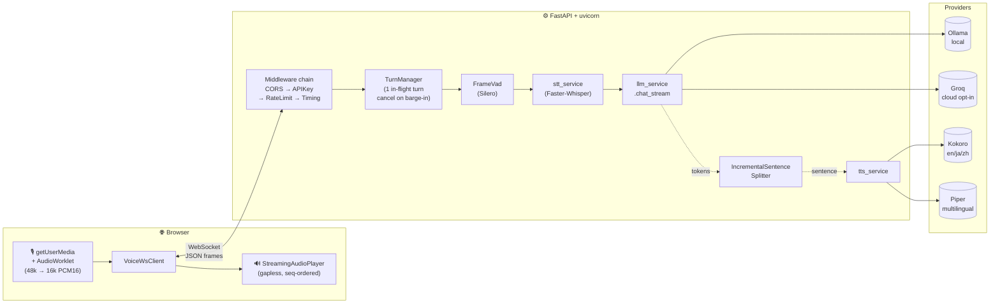
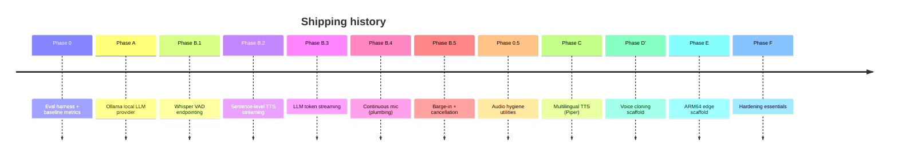

# Voice Assistant — Local-first, Streaming, Open-source

> A production-leaning voice assistant that runs **100% on your machine** by default. Speak, get a natural-sounding reply spoken back, with sub-second first-audio-byte latency targeting on a mid-range laptop.

<p align="left">
  <a href="#status"></a>
  <a href="#license"></a>
  
  
  
  
</p>

**Pipeline:** `🎙️ Mic → Faster-Whisper (STT) → Ollama / Groq (LLM) → Kokoro / Piper (TTS) → 🔊 Speakers` — streamed over a single WebSocket.

---

## Table of Contents

- [Why this exists](#why-this-exists)
- [Pros and cons (read before adopting)](#pros-and-cons-read-before-adopting)
- [Status](#status)
- [Quickstart](#quickstart)
- [Architecture at a glance](#architecture-at-a-glance)
- [Configuration](#configuration)
- [Benchmarks & eval harness](#benchmarks--eval-harness)
- [Project layout](#project-layout)
- [API surface](#api-surface)
- [Roadmap](#roadmap)
- [Documentation](#documentation)
- [Security](#security)
- [Contributing](#contributing)
- [License](#license)

---

## Why this exists

Every major voice assistant today is cloud-only, closed, and sends your microphone audio to someone else's datacenter. This project is the opposite: a **streaming, local-first** pipeline you can audit line by line, run disconnected from the internet, and swap components out of.

Design principles:

1. **Local by default, cloud when useful.** Ollama is the default LLM; Groq is a swap for benchmarking / low-RAM hardware.
2. **Measure before you optimize.** Every phase ships alongside an eval runner and a design doc. No "feels faster" claims — see [ADR 0001](docs/adr/0001-eval-harness.md).
3. **Small, reversible commits.** Each phase is independently revertible. No big-bang migrations.
4. **Honest caveats over marketing.** The "cons" section below is longer than the "pros" — on purpose.

---

## Pros and cons (read before adopting)

### ✅ Pros

| What | Why it matters |
|---|---|
| **100% offline capable** | No API keys, no cloud, no data egress. `LLM_PROVIDER=ollama` + local STT/TTS. |
| **Free and open-source end-to-end** | Qwen2.5 (Apache-2.0), Whisper (MIT), Kokoro (Apache-2.0), Piper (MIT), Silero VAD (MIT). No CPML/CC-BY-NC model in the default path. |
| **Streaming pipeline** | LLM tokens and TTS sentences overlap; first audio byte lands before the full reply has generated. |
| **Swappable providers** | `LLM_PROVIDER` (ollama \| groq), `TTS_PROVIDER` (kokoro \| piper \| openvoice). Adding a new one is a single class. |
| **Eval harness built in** | Every claim is measurable: STT WER, LLM keyword-accuracy, TTS RTF, E2E first-audio-byte p50/p95. |
| **Hardened for exposure** | Opt-in API key, in-memory rate limiter, JSON logging, CORS allowlist. Not just localhost-grade. |
| **Multilingual TTS path** | Piper voices for Hindi, Tamil, Telugu, Bengali, Marathi, and 30+ others. |

### ⚠️ Cons / honest caveats

| What | Impact |
|---|---|
| **Local LLM quality < frontier APIs** | Qwen2.5-3B is good but not GPT-4. For deep reasoning, switch `LLM_PROVIDER=groq` or run `qwen2.5:7b` if you have the RAM. |
| **Sub-500 ms is aspirational, not guaranteed** | Target is <1 s first-audio-byte on CPU + 3B model. <500 ms requires a GPU and careful tuning. See [Benchmarks](#benchmarks--eval-harness). |
| **Browser AEC is the only echo canceller** | Open-speaker barge-in works because Chrome's `echoCancellation` runs on the mic. Headphones are more reliable. No server-side AEC yet. |
| **No multi-user concurrency tuning** | Single-user design. Model handles are shared; a second concurrent turn serializes on the TTS thread. |
| **Voice cloning is scaffolded, not validated** | Phase D' (OpenVoice v2) ships the provider + consent gate, but the model setup + watermarking are a manual one-time step. See [phase-d-notes](docs/design/phase-d-notes.md). |
| **Raspberry Pi build untested here** | Phase E has the ARM Dockerfile + perf targets but needs a physical Pi to validate. |
| **Sentence splitter is naive** | "Dr. Smith" may split early. Acceptable in practice; fix is tracked. |
| **Rate limit is in-memory, single-process** | Swap for Redis if you deploy multiple replicas. |
| **WebSocket auth not wired by default** | `require_api_key_ws` exists in `app/core/auth.py` but `/ws/voice` doesn't call it yet. One-line change when you deploy. |
| **`faster-whisper` on CPU is the latency floor** | Real streaming STT (whisper-streaming, Moonshine) would cut 200–500 ms but is deferred. |

---

## Status

| Phase | Scope | State | Notes |
|---|---|---|---|
| 0 | Eval harness + baseline metrics | ✅ shipped | [docs/adr/0001](docs/adr/0001-eval-harness.md) |
| A | Ollama provider (local LLM) | ✅ shipped | [docs/adr/0002](docs/adr/0002-llm-provider-abstraction.md) |
| B.1 | Server-side VAD endpointing | ✅ shipped | [notes](docs/design/phase-b1-notes.md) |
| B.2 | Sentence-level TTS streaming | ✅ shipped | [notes](docs/design/phase-b2-notes.md) |
| B.3 | Streaming LLM tokens → sentences | ✅ shipped | [notes](docs/design/phase-b3-notes.md) |
| B.4 | Continuous mic + server VAD | ⚠️ plumbing only, UI opt-in | [notes](docs/design/phase-b4-notes.md) |
| B.5 | Barge-in + turn cancellation | ✅ click-during-speaking | [notes](docs/design/phase-b5-notes.md) |
| 0.5 | Audio hygiene utilities | ✅ shipped | [notes](docs/design/phase-0.5-notes.md) |
| C | TTS provider abstraction + Piper | ✅ shipped (voice download is manual) | [notes](docs/design/phase-c-notes.md) |
| D' | OpenVoice v2 cloning scaffold | ⚠️ scaffold, needs validation + checkpoints | [notes](docs/design/phase-d-notes.md) |
| E | ARM64 edge build | ⚠️ scaffold, needs hardware | [notes](docs/design/phase-e-notes.md) |
| F | Hardening essentials | ✅ auth, rate limit, CORS, JSON logs, CI | [notes](docs/design/phase-f-notes.md) |

Legend: ✅ runs + tested · ⚠️ builds cleanly but needs user-side validation.

---

## Quickstart

### Option A — Docker (zero-dep, recommended)

```bash
git clone https://github.com/<you>/voice-assistant.git
cd voice-assistant
cp backend/.env.example backend/.env      # defaults to LLM_PROVIDER=ollama
docker compose up
```

First boot downloads `qwen2.5:3b` into the `ollama_data` volume (~2 GB). Open http://localhost:5173.

### Option B — Native (Python + Node)

Prerequisites: Python 3.11+, Node 20+, [Ollama](https://ollama.com), `ffmpeg`.

```bash
# Terminal 1 — LLM
ollama pull qwen2.5:3b

# Terminal 2 — backend
cd backend
python -m venv .venv && . .venv/Scripts/activate    # Linux/macOS: source .venv/bin/activate
pip install -r requirements.txt
cp .env.example .env
python run.py                                         # → http://localhost:8000

# Terminal 3 — frontend
cd frontend
npm ci
npm run dev                                           # → http://localhost:5173
```

### Option C — Cloud LLM (fastest, requires Groq sign-up)

```bash
# backend/.env
LLM_PROVIDER=groq
GROQ_API_KEY=<your-free-key-from-console.groq.com>
```

No Ollama needed. STT + TTS still run locally.

---

## Architecture at a glance



Deep dive, tradeoffs, and failure modes: [ARCHITECTURE.md](ARCHITECTURE.md).

---

## Configuration

Everything is env-driven. Full reference in [backend/.env.example](backend/.env.example). The ones you actually change:

| Variable | Default | What it does |
|---|---|---|
| `LLM_PROVIDER` | `ollama` | `ollama` (local) \| `groq` (cloud) |
| `OLLAMA_MODEL` | `qwen2.5:3b` | Try `qwen2.5:7b` on ≥16 GB RAM |
| `OLLAMA_HOST` | `http://localhost:11434` | Point at a remote Ollama if desired |
| `GROQ_API_KEY` | *(empty)* | Required when `LLM_PROVIDER=groq` |
| `TTS_PROVIDER` | `kokoro` | `kokoro` \| `piper` \| `openvoice` |
| `PIPER_VOICE` | *(empty)* | e.g. `hi_IN-pratham-medium` |
| `WHISPER_MODEL_SIZE` | `base` | `tiny` / `base` / `small` / `medium` / `large-v3` |
| `WHISPER_VAD_FILTER` | `true` | Silero VAD trim inside Whisper (B.1) |
| `API_KEY` | *(empty)* | Set this when deploying publicly |
| `ALLOWED_ORIGINS` | `*` | Comma-separated list in prod |
| `RATE_LIMIT_PER_MINUTE` | `60` | `0` disables |
| `LOG_FORMAT` | `text` | `json` for structured logs |

---

## Benchmarks & eval harness

This project takes measurement seriously. Every phase has a reproducible eval.

```bash
# Build the baseline (no server needed for LLM + TTS)
python -m eval.runners.baseline

# End-to-end streaming latency (server must be running)
python -m eval.runners.eval_tts --emit-stt-fixtures
python -m eval.runners.eval_streaming \
  --url 'ws://127.0.0.1:8000/ws/voice?stream=1' \
  --fixture eval/datasets/stt/tts-roundtrip-00.wav \
  --runs 10 --save
```

Metrics reported:

| Metric | What it captures |
|---|---|
| `first_llm_delta_ms` | time to first LLM token (isolates LLM latency) |
| `first_audio_byte_ms` | time to first TTS chunk (what the user *feels*) |
| `tts_end_ms` | total turn duration |
| `mean_wer` | Whisper accuracy on your STT manifest |
| `mean_rtf` | TTS synth-time / audio-time |
| `vad_trimmed_ms` | silence removed by Silero VAD |

Results land in `eval/results/*.json` — gitignored, machine-specific. Diff across runs to prove deltas.

Design rationale: [ADR 0001](docs/adr/0001-eval-harness.md).

---

## Project layout

```
.
├── backend/
│   ├── app/
│   │   ├── main.py              # FastAPI app + middleware chain
│   │   ├── config.py            # All env-driven knobs
│   │   ├── core/
│   │   │   ├── auth.py          # APIKeyMiddleware + WS gate
│   │   │   ├── rate_limit.py    # Token-bucket per-key/IP
│   │   │   ├── logging.py       # JSON / text formatter
│   │   │   └── timing.py        # Per-stage X-Stage-*-Ms headers
│   │   ├── routers/
│   │   │   └── pipeline.py      # /api/pipeline + /ws/voice
│   │   ├── services/
│   │   │   ├── stt_service.py   # Faster-Whisper wrapper
│   │   │   ├── llm_service.py   # Thin router to llm/ providers
│   │   │   ├── llm/             # Ollama | Groq providers
│   │   │   ├── tts_service.py   # Thin router to tts/ providers
│   │   │   └── tts/             # Kokoro | Piper | OpenVoice
│   │   ├── streaming/
│   │   │   ├── async_stream.py  # Sync→async generator bridge
│   │   │   ├── sentence_splitter.py
│   │   │   ├── turn_manager.py  # Single in-flight turn + cancel
│   │   │   ├── vad.py           # Silero frame-VAD
│   │   │   └── wav.py           # PCM16 → WAV writer
│   │   └── audio/resample.py    # Hygiene utilities
│   ├── tests/                   # pytest unit tests
│   ├── requirements.txt
│   ├── pyproject.toml           # pytest + ruff config
│   └── Dockerfile[.arm64]
├── frontend/
│   ├── public/recorder-worklet.js
│   ├── src/
│   │   ├── audio/               # streamingPlayer, microphoneStream, clientVad
│   │   ├── services/            # voiceWsClient, consent
│   │   └── components/          # VoiceAssistant, ConsentGate
│   └── package.json
├── eval/
│   ├── lib/{metrics,reporter}.py
│   ├── runners/eval_{llm,stt,tts,latency,streaming,baseline}.py
│   └── datasets/                # Golden Q&A + STT/TTS prompts
├── docs/
│   ├── adr/                     # Architecture Decision Records
│   ├── design/                  # Phase-by-phase notes (B.1–F)
│   └── design-doc-template.md
├── docker-compose.yml           # Ollama + backend + frontend
└── .github/workflows/ci.yml     # Lint + test matrix
```

---

## API surface

### REST

- `POST /api/pipeline` — one-shot: audio in, `{transcript, response, audio_b64}` out. Good for eval; simple clients.
- `POST /api/stt/transcribe`, `POST /api/chat/`, `POST /api/tts/synthesize` — individual stages.
- `GET /health`, `GET /ready` — liveness / readiness.

### WebSocket — `/ws/voice`

Query params:
- `?stream=1` — stream LLM tokens + sentence-level TTS (B.2 + B.3).
- `?continuous=1` — accept `audio_frame` messages; server VAD detects end-of-turn (B.4).

Full protocol, including `barge_in`, `cancelled`, and `llm_delta`, documented in [docs/design/phase-b-streaming-pipeline.md](docs/design/phase-b-streaming-pipeline.md).

---

## Roadmap

See [CHANGELOG.md](CHANGELOG.md) for what landed in each phase and [docs/design/](docs/design) for the design docs.



Next up (priority order):
1. Validate B.2/B.3 in a real browser; capture baseline numbers.
2. Wire B.4 continuous mic into the UI behind a hands-free toggle.
3. Real-speech fixtures for STT eval (currently TTS-roundtrip only).
4. Replace in-memory rate limiter with Redis when a second replica is needed.
5. OpenTelemetry migration for the timing middleware (ADR 0001 follow-up).

---

## Documentation

| Doc | When to read it |
|---|---|
| [README.md](README.md) | This page — overview + quickstart |
| [ARCHITECTURE.md](ARCHITECTURE.md) | Deep dive, dataflow, failure modes, tradeoffs |
| [CHANGELOG.md](CHANGELOG.md) | What shipped in each phase |
| [CONTRIBUTING.md](CONTRIBUTING.md) | Dev setup, style, PR process |
| [SECURITY.md](SECURITY.md) | Threat model + disclosure policy |
| [docs/adr/](docs/adr) | Immutable architectural decisions |
| [docs/design/](docs/design) | Per-phase ship notes (B.1 → F) |
| [docs/design-doc-template.md](docs/design-doc-template.md) | Template for your next phase |
| [eval/README.md](eval/README.md) | How to run + read benchmarks |

---

## Security

- API key gate, rate limiter, CORS allowlist are opt-in (set `API_KEY`, `ALLOWED_ORIGINS`).
- Mic audio never leaves the box in local mode (`LLM_PROVIDER=ollama`). Verify with the Network tab.
- No audio retention: server holds the current turn's PCM in memory and drops it.
- Voice cloning path is gated by a consent modal; see [phase-d-notes](docs/design/phase-d-notes.md).
- Report vulnerabilities via the process in [SECURITY.md](SECURITY.md). Do not file public issues for security bugs.

---

## Contributing

PRs welcome. Rules:

1. Open an issue first for anything non-trivial.
2. New phases or protocol changes require a design doc in `docs/design/` before code.
3. Every change that claims a perf or quality delta must include eval-harness numbers in the PR description.
4. Tests pass, lint clean: `pytest backend/tests` + `npx eslint frontend/src`.
5. Conventional commits (`feat:`, `fix:`, `docs:`, `refactor:`, `test:`).

Full guide: [CONTRIBUTING.md](CONTRIBUTING.md).

---

## License

MIT — see [LICENSE](LICENSE). Third-party components retain their own licenses; see the credits block in [ARCHITECTURE.md](ARCHITECTURE.md#credits).

---

## Credits

Built on top of: [Ollama](https://ollama.com), [faster-whisper](https://github.com/SYSTRAN/faster-whisper) / [OpenAI Whisper](https://github.com/openai/whisper), [Kokoro](https://github.com/hexgrad/kokoro), [Piper](https://github.com/rhasspy/piper), [Silero VAD](https://github.com/snakers4/silero-vad), [Qwen](https://github.com/QwenLM/Qwen), [FastAPI](https://fastapi.tiangolo.com), [Vite](https://vitejs.dev), [React](https://react.dev). Thanks to every maintainer above.
