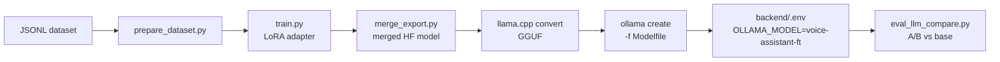

# Fine-tuning (Phase G.3)

LoRA fine-tune **Qwen2.5-3B-Instruct** on a small chat dataset, then serve
it via Ollama so the rest of the voice-assistant stack can use it without
any code change. Measurable before/after in the eval harness (keyword
accuracy, LLM-as-judge, latency).

This directory has two entry points:

1. **`train.ipynb`** — Google Colab / Kaggle paint-by-numbers notebook.
   Use this if you don't have a local GPU.
2. **`train.py`** — the same logic as a CLI script, for anyone with a
   local CUDA GPU (or who wants reproducibility outside a notebook).

## What you'll need

- **GPU:** Colab free T4 (16 GB) or Kaggle free P100 (16 GB). No card
  required. Locally, any NVIDIA GPU with ≥ 8 GB VRAM works.
- **Disk:** ~8 GB for the base model + merged output. Colab/Kaggle have
  enough by default.
- **Dataset:** `dataset_example.jsonl` ships with 25 rows for a smoke
  test. Real quality signal needs 200–500 rows minimum.

## End-to-end flow



## Quickstart (Colab notebook path — recommended for first-timers)

1. Open [`train.ipynb`](train.ipynb) in Colab. Runtime → GPU → T4.
2. Run the cells top to bottom. Training on the 25-row sample takes ~10
   minutes.
3. Download the `finetune/out/` folder.
4. On your laptop (where the voice assistant runs):
   ```bash
   cd finetune/out
   ollama create voice-assistant-ft -f Modelfile
   ```
5. In `backend/.env`:
   ```
   LLM_PROVIDER=ollama
   OLLAMA_MODEL=voice-assistant-ft
   ```
6. Restart the backend. The voice assistant is now answering with your
   fine-tuned model.

## Quickstart (local GPU)

```bash
# Install training deps in an isolated venv
python -m venv .venv-train
. .venv-train/bin/activate    # Windows: .venv-train\Scripts\activate
pip install -r finetune/requirements.txt

# Prepare splits
python finetune/prepare_dataset.py \
    --input finetune/dataset_example.jsonl \
    --out-dir finetune/data \
    --eval-frac 0.2

# Train (10-15 min on a 3090; 25-40 min on a T4)
python finetune/train.py \
    --train-file finetune/data/train.jsonl \
    --eval-file  finetune/data/eval.jsonl \
    --out-dir    finetune/out

# Merge + convert to GGUF (needs llama.cpp checked out beside this repo)
git clone --depth 1 https://github.com/ggerganov/llama.cpp
cd llama.cpp && pip install -r requirements.txt && cmake -B build && cmake --build build --config Release -j
cd ..
python finetune/merge_export.py \
    --adapter finetune/out/adapter \
    --llama-cpp-dir llama.cpp

# Register with Ollama
cd finetune/out
ollama create voice-assistant-ft -f Modelfile
```

## A/B against the base model

The whole point of building an eval harness first is so this step is
meaningful, not vibes:

```bash
python -m eval.runners.eval_llm_compare \
    --base qwen2.5:3b \
    --finetuned voice-assistant-ft \
    --judge ollama \
    --save
```

Output is a side-by-side table of keyword accuracy, judge scores
(correctness / relevance / conciseness / overall) with Δ, and latency.
Saved JSON under `eval/results/llm_compare-*.json`.

## Growing the dataset

25 rows is a smoke test; don't quote those numbers. To get a real
quality signal:

- **Build your own** — write ~200 prompt/reply pairs in the exact
  style you want the assistant to adopt. Concise, consistent, factual.
- **Use a public dataset** — [UltraChat-200k][ultra],
  [LIMA][lima], or domain-specific sets on HuggingFace. Filter to
  short replies if the target is voice.
- **Synthesize with a stronger model** — prompt GPT-4 / Claude /
  Llama-3.3-70b with "rewrite this question-answer pair to match [rubric]"
  and keep the ones that pass manual review.

[ultra]: https://huggingface.co/datasets/HuggingFaceH4/ultrachat_200k
[lima]: https://huggingface.co/datasets/GAIR/lima

Target for meaningful LoRA signal: **200–500 rows minimum**, deduped,
with clear style consistency. Quality beats quantity — 50 rigorously
curated examples beats 500 noisy ones.

## What LoRA is doing (plain-English)

LoRA freezes the base model's weights and learns a tiny "correction"
matrix that sits alongside every attention/MLP layer. The correction is
just a pair of low-rank matrices `A ∈ ℝ^(d×r)` and `B ∈ ℝ^(r×d)` where
`r` is small (16 in our config). At inference, the effective weight is
`W + B·A`. You train only `A` and `B` — typically < 1% of the base
model's parameters — which is why it fits on a free GPU. See
[Hu et al. 2021][lora-paper] for the full story.

[lora-paper]: https://arxiv.org/abs/2106.09685

## Honest caveats

- **Small datasets overfit fast.** Watch `eval_loss`. If it goes up
  after epoch 1, lower LR or cut epochs. The default 3 epochs is for
  200+ rows; 25 rows usually wants 1-2 epochs.
- **Style transfer ≠ knowledge transfer.** Fine-tuning teaches tone and
  format, not facts. For new knowledge, use RAG.
- **Quant loss.** Q4_K_M GGUF is ~2 GB and loses a small amount of
  quality vs fp16. Measurable with the judge runner. Q5_K_M gives back
  most of the quality at +400 MB.
- **Licenses.** Qwen2.5 is Apache-2.0 (use anywhere). If you switch
  to Llama, re-check Meta's community license for your use case.

## Files in this directory

| File | What it does |
|---|---|
| [`dataset_example.jsonl`](dataset_example.jsonl) | 25-row seed dataset in HF chat format |
| [`prepare_dataset.py`](prepare_dataset.py) | Validate + train/eval split |
| [`train.py`](train.py) | LoRA fine-tune (HF `transformers` + `peft` + `trl`) |
| [`train.ipynb`](train.ipynb) | Same flow, Colab/Kaggle-ready |
| [`merge_export.py`](merge_export.py) | Merge adapter + GGUF + Ollama Modelfile |
| [`Modelfile.template`](Modelfile.template) | Template Ollama Modelfile |
| [`requirements.txt`](requirements.txt) | Training-only deps |

## Follow-up reading

- Design rationale + risks: [`docs/design/phase-g3-lora-finetune.md`](../docs/design/phase-g3-lora-finetune.md)
- How this integrates with the eval harness: [ADR 0001](../docs/adr/0001-eval-harness.md)
- LLM-as-judge details: [`docs/design/phase-g1-llm-judge.md`](../docs/design/phase-g1-llm-judge.md)
